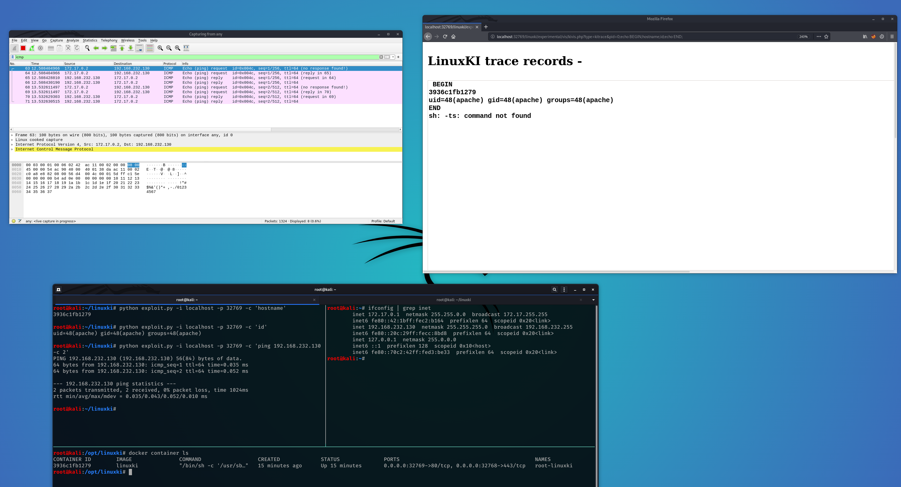

# CVE-2020-7209
HP LinuxKI &lt;= v6.0-1 "kivis.php" Remote Command Injection

# Timeline

- February 6, 2020 - Discovered Issue
- February 6, 2020 - Submitted Bug Report To Vendor
- February 12, 2020 - Verified Patch
- February 12, 2020 - CVE-2020-7209 Assigned
- May 17, 2020 - Disclosed

# Special Thanks
I would like to make a very special thank you to Mark Menkhus and Mark Ray from Hewlett Packard for the very quick and friendly responses, as well as the quick turnaround with patching during the reporting process. You guys are rockstars! 

Also a very special thank you to [Chris Inzinga](https://github.com/cinzinga) for helping with the initial vulnerability discovery!
